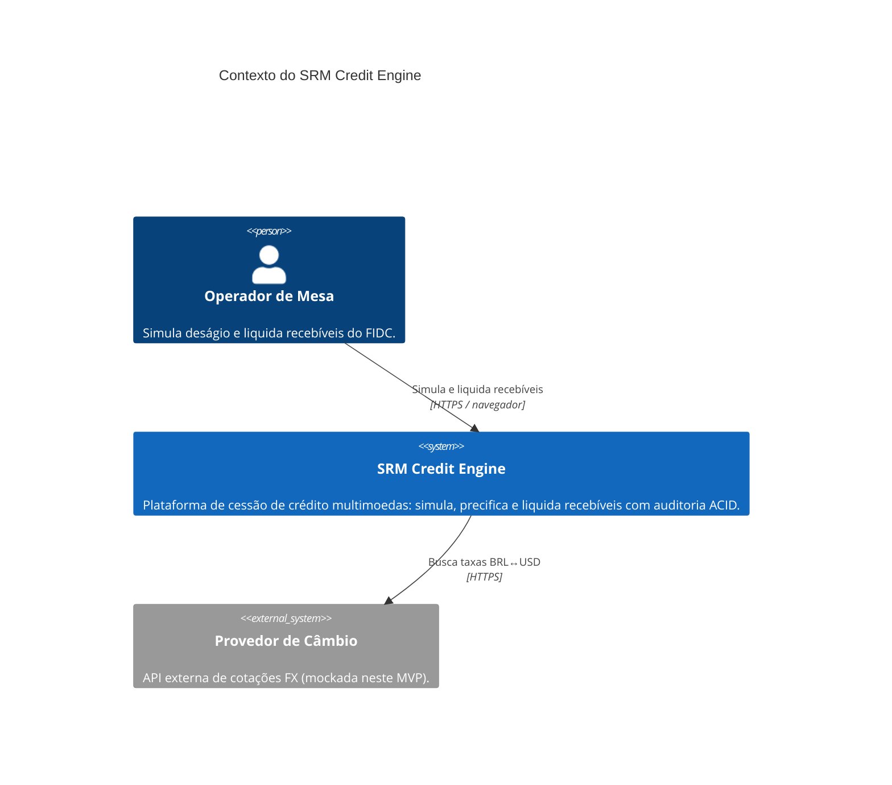
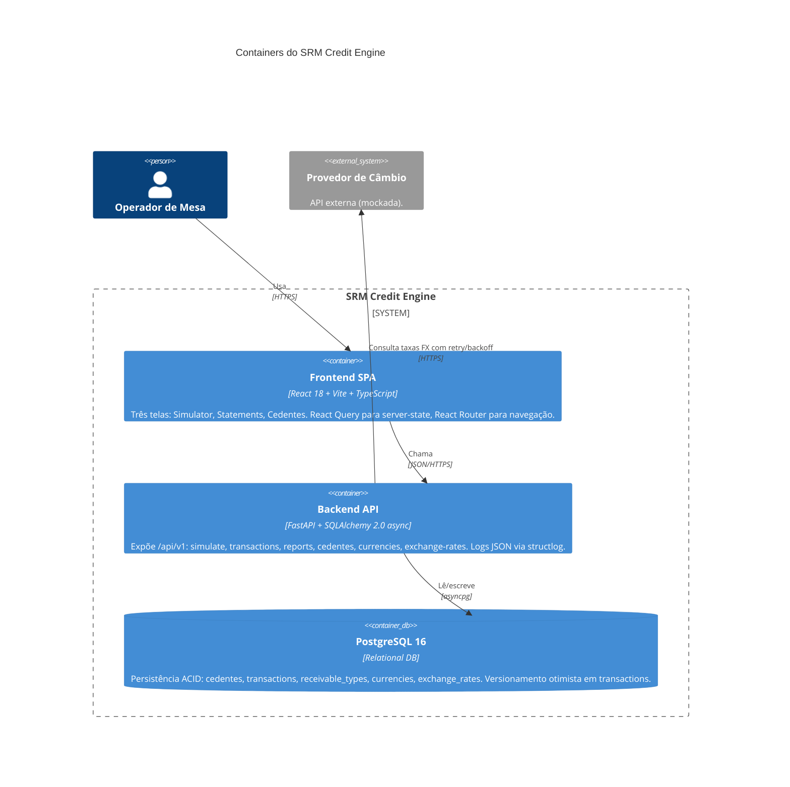

# Diagramas C4 — SRM Credit Engine

Modelo [C4](https://c4model.com/) níveis 1 (Context) e 2 (Container). Renderizado via Mermaid — GitHub faz o parse nativamente.

---

## Nível 1 — Context

Situa o sistema no ecossistema do qual participa.

**Pontos-chave**

- Um único ator humano (operador de mesa) — a plataforma é operacional, não multi-tenant no MVP.
- A dependência externa é exclusivamente o provedor de câmbio, com retry/backoff no client ([backend/app/services/exchange_rate_client.py](../backend/app/services/exchange_rate_client.py)). No MVP o provedor é mockado.
- Nada de event bus, webhooks ou sistemas downstream — toda a análise é via query no próprio banco.

---

## Nível 2 — Container

Decompõe o sistema nos containers deployáveis.

**Decisões refletidas no diagrama**

- **Monolito modular no backend.** O case é pequeno; splitting em microserviços agora seria YAGNI. A separação em camadas (api / services / repositories) facilita extração futura sem forçá-la hoje.
- **Postgres como single source of truth.** Valores financeiros em `NUMERIC(20,8)` para precisão decimal, `version_id_col` no model `transactions` para optimistic locking ([backend/app/models/transactions.py](../backend/app/models/transactions.py)).
- **SPA separada do backend.** Frontend em container próprio, comunicação puramente por API REST — deploys independentes, CORS configurado em [backend/app/main.py](../backend/app/main.py).
- **FX como dependência externa isolada.** Resiliência (retry) fica no client; se o provedor real cair, só o refresh de taxas é afetado, não a simulação/liquidação (que usa a taxa mais recente já persistida).

---

## O que fica de fora do C4 neste MVP

- **Cache (Redis).** Não há leitura quente que justifique hoje. Reports com paginação server-side + índices são suficientes.
- **Fila / worker.** Liquidação é síncrona — o usuário espera o 201 e recebe a transação criada. Não há job assíncrono.
- **Observability stack (Grafana/Tempo).** Logs estruturados em JSON já permitem ingestão por qualquer agregador; métricas Prometheus ficariam naturais numa evolução, sem reestruturar o sistema.

Ver [ARQUITETURA.md](../ARQUITETURA.md) para o racional completo.
