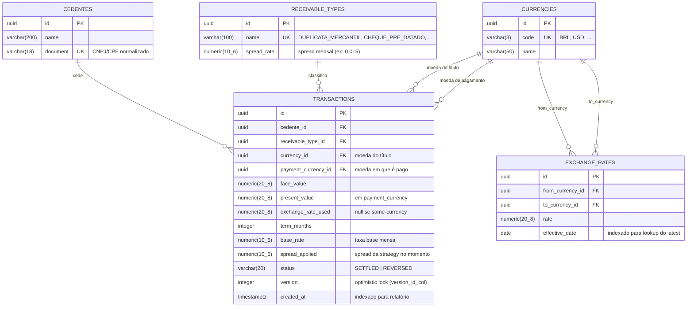

# Diagrama ER — SRM Credit Engine

Derivado dos models em [backend/app/models/](../backend/app/models/). Todos os `id` são `UUID` gerados na aplicação; valores monetários usam `NUMERIC(20,8)` (precisão decimal total, sem `FLOAT`).

---

## Decisões de modelagem

### Por que duas FKs de `currencies` em `transactions`?

Operação cross-currency: o título pode estar em BRL e o pagamento em USD. Guardar apenas uma moeda perderia a auditoria. `exchange_rate_used` é `NULL` para operações same-currency — evita gravar taxa 1.0 falsa.

### Por que `NUMERIC` em todo lugar monetário?

`FLOAT`/`DOUBLE PRECISION` introduz erros de arredondamento binários inaceitáveis em finanças. Padrão do projeto: `NUMERIC(20,8)` para valores e `NUMERIC(10,6)` para taxas/spreads. A stack carrega `Decimal` end-to-end — Python `Decimal` ↔ Postgres `NUMERIC` ↔ JSON string.

### Por que `spread_applied` é snapshot e não FK pra `receivable_types`?

A política de spread pode mudar ao longo do tempo. Guardar o valor aplicado no momento da liquidação congela a decisão — reconciliações futuras não são invalidadas por updates na tabela de tipos.

### Optimistic locking em `transactions`

A coluna `version` é gerenciada pelo SQLAlchemy via `__mapper_args__ = {"version_id_col": version}` ([backend/app/models/transactions.py:42](../backend/app/models/transactions.py)). O `PATCH /transactions/{id}/status` exige o `version` corrente no payload; mismatch → 409 Conflict. Duas reversões simultâneas não corrompem a transação.

### Por que `effective_date` e não `valid_from/valid_to`?

Simplificação deliberada: o repositório busca sempre "a taxa mais recente cujo `effective_date <= hoje`". Bitemporalidade completa (valid + transaction time) é YAGNI para o MVP — vira evolução se o sistema precisar reprocessar histórico.

### Índices

Definidos nos FKs usados em filtros de relatório (`cedente_id`, `currency_id`, `payment_currency_id`) e em `created_at` (cobertura do filtro temporal do extrato). Queries de relatório em [backend/app/repositories/statement_repository.py](../backend/app/repositories/statement_repository.py) usam SQL nativo com bindparams.

---

## Script DDL

Ver [docs/ddl.sql](ddl.sql) (gerado via `pg_dump --schema-only --no-owner --no-privileges` após `alembic upgrade head`).
